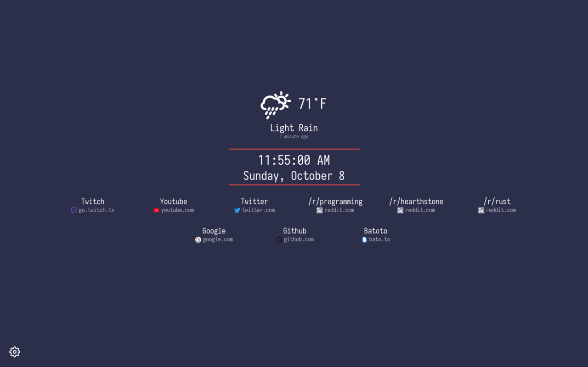

Minimal New Tab Page
===

Minimal new tab page extension for Chrome.

[Download the extension here.](https://chrome.google.com/webstore/detail/minimal-new-tab/oefebaomaahemfkgjdeaokigmcflbfna)

Screenshots
---

Development &amp; Building
---

*Gulp must be installed globally or at least be on your path for these commands to work as they are shown.*

- **Watch:** While developing, you will probably want to have the watcher running. Simply run `gulp watch` to clean, build, and then start watching the project for changes. You will still have to reload the extension if you make changes to the manifest or the background page, but new code can be loaded in the new tab by simply reloading the page.

- **Build:** Running `gulp build` will create a development build (with sourcemaps and without minifying) in the `dist` directory.

- **Production Build:** Running `gulp build:prod` will create a production build (without sourcemaps and with minifying) in the `dist` directory.

- **Packaing for Chrome Web Store:** To package the extension for uploading to the Chrome Web Store, simply run `yarn run pkg` or `npm run pkg` to create a zip file with the name `minimalnewtab-[version].zip` in the `builds` directory. The zip file can be uploaded on the Chrome Web Store.

Help
---

- **Fav Icons aren't displaying correctly on the speed dial**  
    Unfortunately this is just an issue that comes with using `chrome://favicon`. The URLs required to get the correct favicon can be very specific. I would try adding `https://`, `http://`, or some other protocol if you haven't already. You should also try adding `www.` to the beginning of a URL if it will still continue working after you do so. This fixes the favicon in the case of `google.com`. `https://google.com` probably won't work but `https://www.google.com` will.
- **Using Dark Sky**  
    At the moment I only support [Dark Sky](https://darksky.net) for the weather widget, but I'm open to adding other backends if they're not too much trouble. You'll need a latitude/longitude (which you can obtain from [here](https://www.latlong.net/convert-address-to-lat-long.html)) as well as a Dark Sky secret key. You'll have to make an account [here](https://darksky.net/dev) and then navigate to the [console](https://darksky.net/dev/account) in order to to obtain the key. At the moment I don't have an available server to set up as a proxy to the API so you'll need your own key.

Credits
---

- Weather Icons Are By [Daniel Vierich](http://www.danvierich.de/)