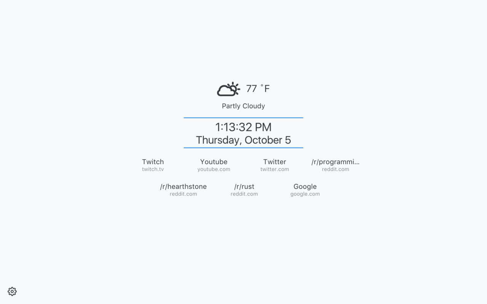

Minimal New Tab Page
===

Minimal new tab page extension for Chrome.

[Download the extension here.](https://chrome.google.com/webstore/detail/minimal-new-tab/oefebaomaahemfkgjdeaokigmcflbfna)

Screenshots
---

Development &amp; Building
---

*Gulp must be installed globally or at least be on your path for these commands to work as they are shown.*

- **Watch:** While developing, you will probably want to have the watcher running. Simply run `gulp watch` to clean, build, and then start watching the project for changes. You will still have to reload the extension if you make changes to the manifest or the background page, but new code can be loaded in the new tab by simply reloading the page.

- **Build:** Running `gulp build` will create a development build (with sourcemaps and without minifying) in the `dist` directory.

- **Production Build:** Running `gulp build:prod` will create a production build (without sourcemaps and with minifying) in the `dist` directory.

- **Packaing for Chrome Web Store:** To package the extension for uploading to the Chrome Web Store, simply run `yarn run pkg` or `npm run pkg` to create a zip file with the name `minimalnewtab-[version].zip` in the `builds` directory. The zip file can be uploaded on the Chrome Web Store.

Credits
---

- Weather Icons Are By [Daniel Vierich](http://www.danvierich.de/)